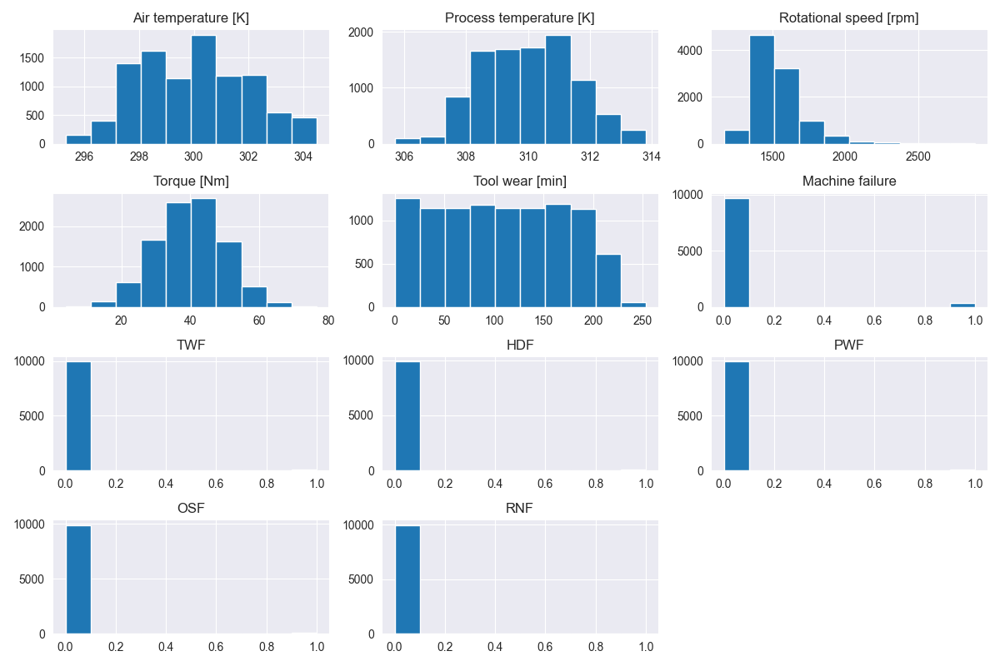
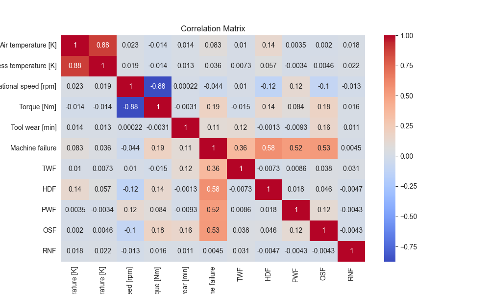
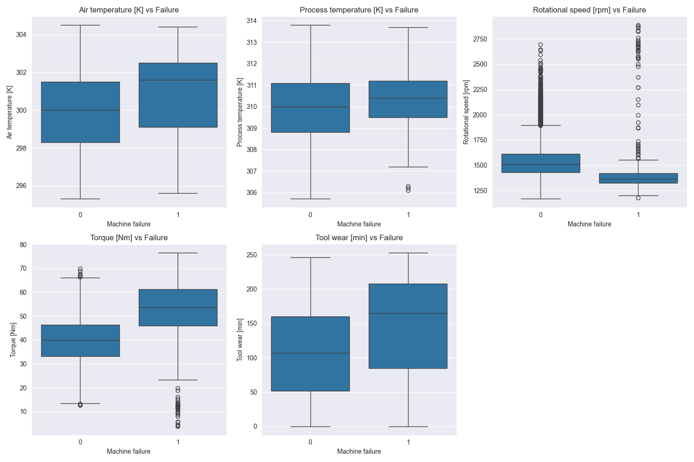
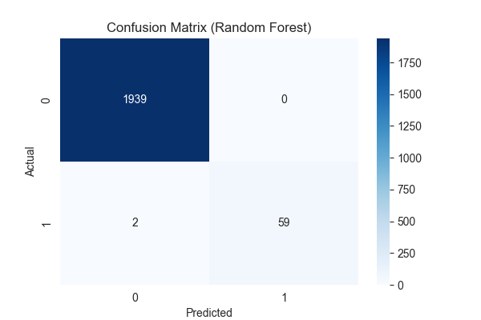
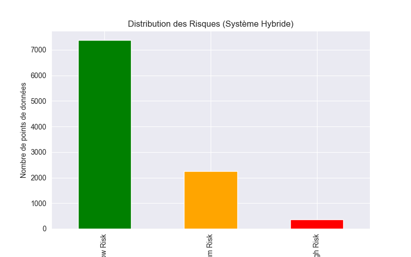

# Projet de Maintenance Prédictive (ai4i2020)

Ce projet analyse le jeu de données `ai4i2020` pour prédire les pannes de machines à l'aide d'un système hybride d'intelligence artificielle.

## À Propos du Dataset

Ce dataset synthétique est modélisé d'après une machine de fraisage existante et se compose de 10 000 points de données stockés sous forme de lignes avec 14 caractéristiques en colonnes.

### Caractéristiques :
- **UID** : Identifiant unique de 1 à 10 000.
- **Product ID** : Composé d'une lettre L, M ou H pour les variantes de qualité (Low 50%, Medium 30%, High 20%) et un numéro de série.
- **Type** : Type de produit (L, M ou H).
- **Air temperature [K]** : Générée via un processus de marche aléatoire normalisé (300 K +/- 2 K).
- **Process temperature [K]** : Générée via une marche aléatoire (Air temperature + 10 K +/- 1 K).
- **Rotational speed [rpm]** : Calculée à partir d'une puissance de 2860 W, avec un bruit normalement distribué.
- **Torque [Nm]** : Valeurs normalement distribuées autour de 40 Nm (SD = 10 Nm, pas de valeurs négatives).
- **Tool wear [min]** : L'usure de l'outil augmente de 5/3/2 minutes selon la variante de qualité (H/M/L).
- **Machine failure** : Étiquette binaire indiquant si la machine a échoué.

### Modes de Défaillance :
La machine échoue si au moins l'un des modes suivants est vrai :
1. **Tool Wear Failure (TWF)** : Usure de l'outil entre 200 et 240 min.
2. **Heat Dissipation Failure (HDF)** : Différence de température < 8.6 K et vitesse < 1380 rpm.
3. **Power Failure (PWF)** : Puissance (Torque * Speed) < 3500 W ou > 9000 W.
4. **Overstrain Failure (OSF)** : Produit de l'usure et du couple > seuil (L: 11k, M: 12k, H: 13k).
5. **Random Failures (RNF)** : 0,1 % de chance de panne aléatoire.

### Attribution :
S. Matzka, "Explainable Artificial Intelligence for Predictive Maintenance Applications," 2020 Third International Conference on Artificial Intelligence for Industries (AI4I), 2020, pp. 69-74, doi: 10.1109/AI4I49448.2020.00023.

## Analyse des Données

### 1. Compréhension des Données
- **Type de données** : Analyse structurelle avec `df.info()`.
- **Statistiques Descriptives** : Aperçu statistique avec `df.describe()`.
- **Prétraitement** : Suppression des colonnes inutiles (`UDI`, `Product ID`).

### 2. Analyse de la Distribution et Corrélation
- **Distribution** : La plupart des variables suivent des distributions normales ou multimodales.

- **Corrélation** : La matrice montre des relations fortes entre le couple et la vitesse (inverse), ainsi qu'entre les températures.

### 3. Analyse des Boxplots (Observations Clés)
La comparaison des variables par rapport à la cible `Machine failure` révèle des insights cruciaux :

1. **Outliers et Box-plots** : La présence d'observations atypiques est constatée via les box-plots. Pour la maintenance prédictive, ces points ne sont pas des erreurs mais des signaux faibles de panne.
2. **Tendances (Lecture Horizontale)** : Les graphiques (ex: Torque vs Failure) montrent une tendance haussière du couple lors des pannes. Une machine sous haute contrainte de couple a une probabilité de défaillance nettement plus élevée.
3. **Dispersion (Lecture Verticale)** : On observe une hétérogénéité accrue des paramètres physiques lors des pannes (vitesse et couple notamment). L'instabilité des mesures est souvent précurseur d'un arrêt machine.

### 4. Gestion des Outliers et Feature Engineering
Les valeurs extrêmes de couple (`Torque`) et de vitesse (`Rotational speed`) ont été transformées en variables d'alerte :
- **Torque_Alert** : Basé sur l'IQR, identifie les contraintes mécaniques extrêmes.
- **Speed_Alert** : Identifie les survitesses.

---

## Performance des Modèles

### 1. Random Forest (Composant ML)
Le modèle Random Forest atteint une précision de plus de **99%**.
- **Accuracy** : ~0.99
- **ROC AUC** : ~0.98

#### Matrice de Confusion :

La matrice montre que le modèle identifie avec succès la quasi-totalité des pannes (True Positives) avec un nombre très faible de faux positifs, ce qui est crucial pour éviter des maintenances inutiles.

### 2. Isolation Forest (Composant Anomalies)
Ce modèle non supervisé identifie environ 5% des données comme des anomalies statistiques. Il permet de capturer des pannes "invisibles" ou aléatoires que le modèle supervisé pourrait manquer.

---

## Système Hybride AI

Le système de décision final combine les trois piliers pour classer le risque :

### Niveaux de Risque Définis :
- **High Risk** : Critique. La machine présente des anomalies statistiques ET des prédictions de panne ML/Expert. Action immédiate requise.
- **Medium Risk** : Surveillance accrue. Un des composants signale un comportement inhabituel.
- **Low Risk** : Fonctionnement nominal.

### Résultats de la Décision Hybride :
Le croisement avec les pannes réelles montre que le niveau **"High Risk"** capture la majorité des défaillances réelles, tandis que le niveau **"Medium Risk"** sert de zone tampon pour la maintenance préventive.
